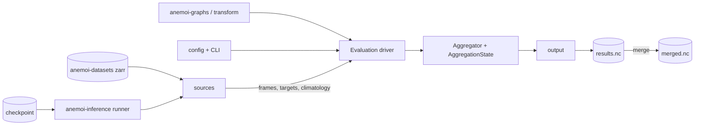
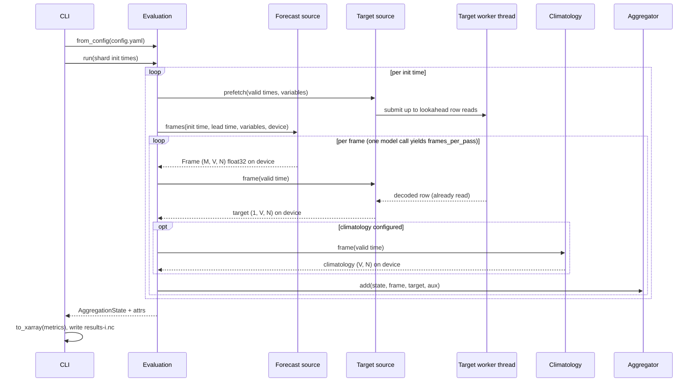

# Architecture

How anemoi-evaluation is built: where it sits in the anemoi stack, what each module is
responsible for, how a run flows through them, and why the structural choices are what they are.
The obligations this structure serves are in [`requirements.md`](requirements.md) and are
referenced by ID (`FR-n`, `NFR-n`) rather than restated. Measured numbers are in
[`../benchmarks.md`](../benchmarks.md); the user-visible surface is in
[`../user-guide.md`](../user-guide.md) and [`../reference.md`](../reference.md).

- [1. Context](#1-context)
- [2. Module map](#2-module-map)
- [3. Components](#3-components)
- [4. Data flow of a run](#4-data-flow-of-a-run)
- [5. Key design decisions](#5-key-design-decisions)
- [6. Extension points](#6-extension-points)
- [7. Results file layout](#7-results-file-layout)
- [8. What the package relies on upstream](#8-what-the-package-relies-on-upstream)
- [9. Deferred designs](#9-deferred-designs)

## 1. Context

anemoi-evaluation is a library plus a thin CLI. It owns no data format of its own beyond its
result file, and it drives the anemoi packages rather than extending them (NFR-17).

| anemoi dependency | what it is used for |
|---|---|
| `anemoi-inference` | the runner that produces the forecasts, the checkpoint metadata, the input states and the forcings providers |
| `anemoi-datasets` | `open_dataset` for the target rows and for the dataset the runner itself reads |
| `anemoi-graphs` | spherical Voronoi cell areas, for grids whose source has no training graph |
| `anemoi-transform` | the cropping mask of a latitude/longitude box, with the longitude wrap |
| `anemoi-utils` | date and duration parsing, human-readable sizes, checkpoint metadata |

Outside anemoi it needs `torch` for the compute device and the reductions, `pydantic` and
`pyyaml` for the configuration, and `xarray`, `netcdf4` and `numpy` for the result file.

The fields flowing from the runner and the zarr into the driver are gigabytes on the device; what
leaves the aggregator is kilobytes.

## 2. Module map

The file-by-file listing is in the repository layout section of
[`../../README.md`](../../README.md); the subsections of section 3 below follow it. What matters
here is that the dependency direction is one way, which is what keeps the package testable without
a checkpoint (NFR-21).

`frame` is depended on by everything and imports nothing from the package; `sources/` depends on
`frame` alone; `aggregation` depends on `frame`, `statistics` and `binning`; `output` depends on
`aggregation` and `metrics`; `evaluate` depends on all of them and on `config`; `__main__` depends
only on `evaluate`, `config`, `output` and `metrics`, the last for rebuilding the metric objects
when merging. Nothing under `sources/` imports the driver.

## 3. Components

### 3.1 Data model: `frame.py`

Two frozen dataclasses.

`Grid` holds `latitudes` and `longitudes`, coerced to 1-D float64 degrees, and offers `n`,
`latlons_rad()`, `check_shape(array, what)` for per-node arrays and
`check_compatible(other, tolerance=1e-5)`, which is how the driver refuses a target or
climatology source on a different grid (FR-8).

`Frame` carries `init_time`, `lead_time`, `valid_time`, `variables` and `data`, a `(M, V, N)`
float32 tensor, and validates all of it on construction: rank, dtype, the variable count against
the columns, and `valid_time == init_time + lead_time`.

The `(M, V, N)` layout is chosen so that the reduction over nodes is one matrix product
`(V, N) @ (N, R)` that produces every region at once, and because both real sources deliver
`(V, N)` natively: zarr rows are `(variables, ensemble, cells)` and the runner yields one `(N,)`
column per variable, stacked once.

### 3.2 Sources: `sources/base.py`

The bring-your-own-data boundary (FR-34). Three `Protocol` classes state the full contracts,
`ForecastSource`, `TargetSource` and `ClimatologySource`, and three base classes,
`ForecastSourceBase`, `TargetSourceBase` and `ClimatologySourceBase`, implement the optional
capabilities with defaults, so a new source subclasses a base and overrides what it can provide.
The members of each protocol are listed in [`../reference.md`](../reference.md).

The contract the driver relies on: `frames()` yields strictly increasing lead times and each
frame's `data` belongs to the caller (NFR-8); an undeliverable variable name raises;
`lead_times()` raises unless the lead time is a positive multiple of the source's timestep, rather
than rounding down; `frames_per_pass` says how many frames land together, which sizes the prefetch
(NFR-20) and indexes the reseeding (FR-3); and `frame()` raises `MissingTargetError` when a target
is unavailable, which the driver's policy turns into a warning and a frame counted nowhere
(FR-10).

### 3.3 Forecasts: `sources/anemoi_inference.py`

`InferenceForecastSource(members=1, seed=0, quiet=True, forcings_cache_bytes=1 GiB, **run_config)`
consumes those four keys; everything else is the anemoi-inference run configuration. It builds a
runner at construction, reads the checkpoint metadata, and lets the runner load the model lazily
on the first forecast, which is what keeps a dry run model-free (FR-28).

Construction enforces the invariants: `output` must be `"none"` (forecasts stay in memory, FR-1,
and the process stays clear of anemoi-inference's never-cleared registry of output paths), `date`
must not be set, the datasets must share the timing, the model must decode every dataset, and
`verbosity` defaults to 0. From the checkpoint it takes the timestep, the two multi-step counts
(hence `output_horizon` and `frames_per_pass`), and the uuid and run id for provenance (NFR-5).
With `quiet`, the anemoi-inference loggers and the per-step timer are raised to WARNING while the
source runs.

**Per-dataset views.** The output variables and their typed forms, and the coordinates reduced by
the checkpoint's `grid_indices`, are per dataset and live on a `DatasetForecast` view, one per
dataset in `datasets` (FR-39). A view is an ordinary single-dataset forecast source — it is what
the per-dataset `Evaluation` sees — except that it yields no frames of its own: the rollout is
shared, so `multi_frames()` on the parent yields one frame per dataset per step and the driver
hands each view's frame to its evaluation. Anything a view does not define itself (members,
device, lead times, provenance, the run configuration) is the parent's. A single-dataset
checkpoint keeps the flat API: `grid`, `variables` and `frames()` on the source itself, and the
source is what the `Evaluation` sees, unchanged.

**Refusals.** `_check_shared_timing()` compares the timestep, the multi-step counts and the
offsets across `multi_dataset_metadata` and refuses a checkpoint whose datasets disagree, because
anemoi-inference silently forwards the first dataset's timing as the checkpoint's.
`_check_every_dataset_is_decoded()` reads `config.model.encoders/decoders` from the stored training
config and refuses a downscaler: anemoi-inference's `Runner.forecast` indexes the model output by
every dataset of `metadata_inference` and raises `KeyError` on an input-only one, so such a
checkpoint cannot be run at all. A checkpoint that does not carry the routing is let through.

**Lockstep members.** For one init time the source builds the initial state once, then advances
`members` `run()` generators one step at a time, reseeding the global RNG with
`member_seed(seed, init_time, member, call)` before each member's model call and stacking the
members of a step into one frame. `member_seed` is a 63-bit blake2b hash of its four public
arguments, so a member depends neither on the ensemble size nor on the other members nor on the
interleaving (FR-3). All members must stop together and agree on their step, or the source raises.

**The initial state and lead 0.** `_initial_state()` combines the prognostics, constant-forcings
and dynamic-forcings input states the way `Runner.execute()` does, memoised for the current init
time and released when `frames()` finishes. `initial_frame()` returns the init-time slice of every
requested variable present in that state and NaN for the others (FR-5).

**The forcings cache.** `ForcingsCache` is a host LRU of forcings arrays keyed by provider and
dates, and `SharedForcings` wraps each of the tensor handler's forcings providers so their arrays
come through it (NFR-11). It checks the grid: the first coordinates seen define it, and a request
on another grid bypasses the cache. There is therefore one cache per dataset, each with
`forcings_cache_bytes` of its own; a single cache would serve the first grid and bypass every other
one for ever, silently, since the results would stay correct. Each dataset's result file reports
its own cache's counters; the source's `stats` sums them over the caches.

**Chunk handling.** `inference_env()` implements NFR-12 for the one case that matters: it adds
`ANEMOI_INFERENCE_NUM_CHUNKS_PROCESSOR=1` to the run configuration's `env` block when
`ANEMOI_INFERENCE_NUM_CHUNKS` is set and the processor count is set nowhere, and leaves any
explicit value alone. `inference_chunks()` reports the counts a loaded model actually runs with
(section 8).

**Dates and the graph.** `required_dates()` and `missing_dates()` are the pure helpers behind
`check_init_times()` (FR-7): the lagged input window ending at the init time, plus the valid dates
of every model call but the last, since the runner loads no forcings after its last call.
`graph_node_attribute()` reads a per-node attribute off the loaded model's training graph, and
`dataset_args_kwargs()` returns the `open_dataset` arguments of the runner's own prognostics input
(FR-9). All three take the dataset: the dates are checked per dataset, the targets default to that
dataset's own input, and a multi-dataset graph names the node set after the dataset rather than
`data`, which `graph_node_attribute()` falls back to when `data` is absent.

### 3.4 Targets: `sources/anemoi_dataset.py`

`DatasetTargets` opens an anemoi dataset and serves one row per valid time as `(1, V, N)` float32.
It refuses a dataset with more than one ensemble member (FR-11), builds a date-to-index map once,
honours the dataset's missing dates through `available()` and `MissingTargetError`, and applies the
forecast source's `grid_indices` when built with `from_dataset` or `from_forecast`.

Reading is on one worker thread. `prefetch()` replaces the queue of what comes next, `_pump()`
keeps at most `lookahead` reads in flight, and `frame()` takes the pending future, submits one, or
reads synchronously when the worker is disabled. `_read()` is the only method that touches the
dataset handle after setup, so the chunk read, the decode, the cutout assembly and the selection
all happen on that thread and only the host-to-device copy stays on the main one (NFR-19).
`prefetch_hint()` raises the default depth of 2 to the forecast source's `frames_per_pass` when
that is larger (NFR-20). An optional host LRU of decoded rows pays when init times overlap in valid
time and the reads are not already hidden.

`grid_mask(i)` turns the per-source cell counts of a cutout or join dataset into a boolean mask,
which is what the `grid:` region spec uses (FR-21). `stats` counts rows read, seconds spent reading
them and cache hits (NFR-24).

### 3.5 The other sources

`PersistenceForecastSource` repeats the init-time target at every lead (FR-6). `ArrayClimatology`
is an in-memory mapping from a key to a `(V, N)` float32 field, built from a target source as a
float64 mean per key and round-tripped through netcdf with the grid, the counts and the build
provenance (FR-16); its `frame()` hands out a cached, shared device tensor, the one documented
exception to NFR-8. `FakeForecastSource` and `ArrayTargets` are the synthetic pair the unit tests
run on (NFR-21).

### 3.6 Statistics and metrics: `statistics.py`, `metrics.py`

A `Statistic` maps `(M, V, N)` predictions and a `(1, V, N)` target to `(V, N)` float64 and
declares `min_members` and the per-frame `aux` fields it needs. A `Metric` names the statistics it
consumes (deduplicated across metrics by name), exposes its YAML `spec`, its `min_members`, its optional
extra output dimension `output_dim`, `bind_members(members)` and `from_means(means, members)` mapping
`(L, B, V, R)` means to the metric (FR-12). The stored
primitives, the metrics derived from them and their formulas are listed in
[`../reference.md`](../reference.md); `members` is recorded in the state, which is what lets a
CRPS coefficient be applied after the fact.

Two implementation choices matter. Member reductions run in float64 one variable at a time
(`per_variable`), so no `(M, V, N)` float64 copy ever exists while NFR-1 still holds. And `pairs`
is computed as a weighted sum over the members sorted at each node after centring them on the
target: the weights sum to zero so the centring is free, and the sorted form avoids both the
`(M, M)` pairwise tensor and the cancellation of a naive difference of large numbers.

`REGISTRY` and `from_spec` map a name or a single-key mapping onto a metric instance, which is what
the config layer and the result file's metric list use.

A statistic may be **parametrised**: the threshold statistics carry a label and a per-variable threshold
map, and encode them in the name (`hit_heavy`) so that the state, the netcdf and the merge logic keep
working by name alone. The parameters are also returned from `parameters`, which defines equality, so
`unique_statistics` refuses a name that means two different statistics instead of silently keeping one of
them. The per-variable part is resolved once per run by `bind_variables`, called by `metrics.build` from
`Evaluation.__init__`, where the variable order is already known: the aggregator, the state and the output
are untouched, `aux` stays a mapping of tensors, and a threshold naming an unknown variable fails before a
model is loaded.

A metric may instead depend on the **ensemble size**: the rank histogram has one statistic per rank bin,
so it has none until it knows `M`. It creates them in `bind_members`, called by `metrics.build` from
`Evaluation.__init__`, where `forecast.members` is already known, and from the merge CLI, where it comes
from the file's `members` attr. The metric is a valid object before that (empty statistics, `min_members`
of its own, its bare spec), so the config layer can validate a spec naming it without knowing any run;
rebinding it to a different size raises, since the statistics, the coordinate and every stored sum would
change under an evaluation still holding the instance.

A metric may depend on **both**, as the reliability levels do: they need the run's variables for the
thresholds and its ensemble size for the levels. The `LabelledMetric` mixin carries the label, the name and
the spec for every labelled family, so a metric that cannot build its statistics yet still validates its
label and its map at construction (`statistics.validate_thresholds`), and `ReliabilityMetric` inherits the
`bind_members` machinery unchanged. `metrics.build` fixes the order that makes this work: bind the ensemble
size, check the names and the one-label-one-threshold-map rule, deduplicate the statistics, then bind the
variables on the statistics that exist by then. The label rule is checked without any binding, which is why
it can be enforced at config-validation time, where the statistic identity guard has nothing to compare
yet.

### 3.7 Aggregation: `aggregation.py`

`AggregationState` is the run's entire accumulated result: `sums[statistic]` and `weights` on
`(lead time, bin, variable, region)` and `n_init` on `(lead time, bin)`, plus `members`,
`variable_coords`, the contributing `init_times` and the provenance `attrs`; it validates shapes
and dtypes on construction. `merge` adds the sums, the weights and the counts elementwise and
unions the init times, refusing states whose coordinates, statistics or member count differ, and
states that share an init time, since a shard merged twice would double its weight (FR-32).

`Aggregator` is built once per run from the node weights `w` and the region masks, folded into one
float64 matrix `W = w[:, None] * masks` on the device. For each frame it computes the shared
validity mask `isfinite(pred).all(0) & isfinite(target[0])`, adds `valid.double() @ W` to the
weights, and for every statistic adds `where(valid, statistic.compute(...), 0) @ W` to its sums
(FR-18, FR-19). It computes the ensemble mean once per frame and, with a climatology, the two
anomaly fields and the finite mask once, passing them to the statistics through `aux`; a statistic
whose declared `aux` is missing raises rather than silently computing something else. `aux` is rebuilt for
each frame and handed to every statistic of that frame by reference, so a statistic may also put an
intermediate of its own in it for the others to reuse (the rank bins share `rank_below` and `rank_ties`
that way, the reliability levels of one label the exceedance count and the observed event); the mapping does
not outlive the frame, which is what makes the sharing safe without a cache key. Within a frame the key must
still carry everything that changes the value: the level statistics key on the label because one label
carries one threshold map across a config, and a family without that property would have to key on the
thresholds too.

### 3.8 Weights, regions, bins

`weights.py` and `regions.py` are plain builders returning `(N,)` float64 weights and `(N,)`
boolean masks. Most take only a `Grid`; the graph-attribute weights and regions need the forecast
source, and the sub-grid region needs the target source. `regions.stack()` turns a name-to-mask
mapping into the `(N, R)` matrix. The API boundary is the array, not the spec: the config layer
maps YAML onto these builders (FR-20, FR-21), and a notebook can pass arrays directly.

`binning.py` implements the second state axis as a protocol with `kind`, `by`, `coords` and
`index(frame)`: `SeasonBinning`, `MonthBinning`, `InitTimeBinning` and `NoBinning`, each keyed on
the frame's init time or valid time (FR-22). `InitTimeBinning` with `by: valid_time` enumerates
every valid time the init times reach, which is why shards must be built from the full init-time
list for their bin coordinates to match.

### 3.9 The driver: `evaluate.py`

`Evaluation` is the object the YAML config serialises (FR-23, FR-24). Construction has no side
effects on the model: it validates the arguments, resolves the lead times, checks grid
compatibility, passes `frames_per_pass` to the target source's `prefetch_hint()`, checks the
metrics' member requirements, resolves the device (the explicit argument, then the forecast
source's preference, then cuda if available, then cpu) and finally checks the init times against
the runner's datasets. `weights`, `regions` and `aggregator` are cached properties, so a weight
spec that needs the checkpoint graph loads the model only when `run()` does.

`run()` loops over init times, accumulating into one state inside a single
`torch.inference_mode()`, through `begin()`, `frames()`, `add_frame()`, `charge()` and `finish()`,
which `MultiEvaluation` reuses to drive N evaluations off one rollout; `pairs()` yields
`(frame, target)` for a custom loop in the same mode;
`shard(i, n)` returns `init_times[i::n]` and `run(init_times=...)` accepts any subset (FR-33).
`MultiEvaluation` holds one `Evaluation` per dataset plus the shared source (FR-39). Its `run()`
pulls the shared `multi_frames()` stream once per init time and gives each dataset's frame to that
dataset's evaluation, so the model is called once and every dataset has its own targets, weights,
regions, climatology, aggregator and state; without a shared source (a per-dataset persistence
baseline) it simply runs the evaluations one after the other. `Evaluation.from_config` returns a
`MultiEvaluation` when the run scores more than one dataset, and `metrics`, `variables` and
`attrs()` are then mappings keyed by dataset. The config's `datasets:` key narrows the set of
datasets that are scored: the build makes views, targets, aggregators and results for the selected
ones only, checks the init times of the others itself (the runner reads their inputs all the same)
and, when one dataset is left, hands its view the rollout and the ownership of the runner, so the
run is an ordinary single-dataset one.

`plan()` produces the dry run (FR-28) without loading a model, combining the sources' `describe()`
output with the grid size, the variable info and a target-availability check per valid time.
`time_estimate()` turns a measured step time into shard and run costs, wall being model time plus
an estimated 105 s of startup per shard (about 90 s on a cold node plus the first-call overheads,
[`../benchmarks.md`](../benchmarks.md) sections 7 and 9) and nothing else (FR-29). `PhaseTimer`
charges wall time to `model`, `target` and `statistics` with a CUDA synchronisation before every
mark (NFR-24). `attrs()` assembles the provenance, timings and counters (NFR-5), and `from_config`
/ `to_config` round-trip the object, source objects passed to `from_config` overriding the
configured ones.

### 3.10 Configuration: `config.py`

A pydantic model of the `Evaluation` arguments. Every model forbids unknown keys except the two
pass-through blocks (`anemoi_inference` and `anemoi_dataset`), whose extra keys go to the runner
configuration and to `open_dataset` respectively. Weight and region specs are single-key models
with a `build(grid, forecast, targets)` method, so the YAML vocabulary and the builders of 3.8 stay
in step. `targets`, `variables`, `weights`, `regions` and `climatology` additionally accept a
`datasets: {name: block}` mapping (`PerDataset`), which `per_dataset()` resolves against the
checkpoint's dataset names: all or none, and no name the checkpoint does not have, which is
anemoi-inference's own rule for its per-dataset run-config entries.

Two resolutions happen on the raw mapping before validation, in this order: `resolve_base()`
merges a config on top of the `base:` chain it names (mappings merge key by key, anything else
replaces, cycles are refused), and `resolve_from_checkpoint()` replaces a dataset block's
`from_checkpoint` with the arguments the checkpoint records, the block's own keys on top (FR-25,
FR-26); with multiple datasets it fans out, the runner's `input` block keyed by dataset name as
anemoi-inference wants it and the `targets` block in the `datasets:` form. What the rest of the
package sees is the resolved configuration. Validation happens twice:
at config time (types, unknown keys, single-key specs, durations, metric names) and at
construction (lead time against the timestep, grids, variables, member requirements, dates)
(NFR-23).

### 3.11 Output: `output.py`

`to_xarray(state, metrics)` derives the metrics from the means and builds the result Dataset;
`write()` writes it; `load_state()` reads the raw state back; `merge()` sums states or files.
`merge` combines the attributes as well: it sums the timings and counters, takes the maximum of the
peak memory, unions the init times, replaces the config with a JSON object `{"merge": [...]}` of
the inputs' configs, records the files it merged, and drops or rewrites the shard tag.
`_merged_shard()` implements the shard-set validation of FR-32 and names the offending files.

A metric may declare an **extra output axis** through `output_dim`, returning a name and its coordinate
values; `to_xarray` then writes that metric on the four standard dimensions plus that one and adds the
coordinate. It lives only here: the state, `load_state` and `merge` keep the four-axis shape, one sum per
statistic. That is the cheap side of the trade, because the exactness argument is about the sums and the
sums do not move.

### 3.12 CLI: `__main__.py`

Two subcommands over the API. `resolve_shard()` reads `--shard i/n` or derives it from the Slurm
environment so that job steps and job arrays compose; it uses `SLURM_STEP_NUM_TASKS` rather than
`SLURM_NTASKS` deliberately, because a batch script also sees `SLURM_NTASKS` with `SLURM_PROCID` 0
and would then silently evaluate one shard of n under the full output name.
`format_output_path()` enforces the `{shard}` placeholder for more than one shard (FR-33) and the
`{dataset}` placeholder for a run that scores multiple datasets, which it refuses on a run that
scores one. A shard of such a run writes one file per dataset; merging is then per dataset, and `merge()`
refuses inputs whose `dataset` attributes differ (FR-30). The
module imports torch and the package lazily inside the command functions, so `--help` is cheap.

## 4. Data flow of a run

Nothing but the sums, the weights and the counts survives a frame. Fields stay on the device from
the model output to the sums; the only host-to-device traffic per frame is one target row, and the
only device-to-host traffic in a run is the state at the end (NFR-15, NFR-18).

## 5. Key design decisions

**On-the-fly inference, no forecast fields on disk.** The forecast source is a real
`anemoi-inference` runner and the frames are consumed as they are produced. This is the reason the
package exists (FR-1): at 1.7M nodes and 67 output variables, persisting a campaign's forecasts
costs terabytes and an intermediate format that the comparison would then depend on.

**Targets from the model's own dataset.** The default target source is built from the
`open_dataset` arguments of the runner's own prognostics input, not from the ones the checkpoint
records, so the evaluation period is whatever the run configuration opened (FR-9). Same grid, same
units, no regridding (FR-8).

**Float64 per-element sums and a matrix-product node reduction.** Statistics return float64 and the
reduction over nodes is `values.double() @ W`, which produces every region in one operation and
which TF32 cannot touch (NFR-1). The package sets no global precision knob (NFR-7), and the cost is
milliseconds against seconds of model time (NFR-9).

**One shared validity mask per frame.** The mask is computed from the members and the target
together and drives both the statistic sums and the weight sum, so `sums / weights` is always a
mean over the same nodes (FR-19). The climatology is deliberately outside it (FR-17).

**Weights and regions as arrays, specs only in the config layer.** Regions may overlap and
`global` is a region like any other; only relative weights matter, since every result is a weighted
mean (FR-20, FR-21).

**Ensembles as lockstep rollouts of one runner.** There is no ensemble axis on the path from the
runner to the model: the model does produce every member of its input's ensemble axis in one
forward pass, but `predict_step` hardcodes that axis to size 1, the runner's squeeze silently keeps
an axis larger than one, and the per-variable loop that follows would walk the wrong axis. One
`run()` per member is the only mechanism reachable through the public API. Lockstep costs no extra
FLOPs, never buffers a rollout, and has all M members of a step in hand, which is what the CRPS
primitives need (FR-2); what it costs is M resident working sets and step time linear in M
(NFR-13).

**Multi-step-output handled per model call, not per frame.** `frames_per_pass` is the unit for
three separate things: the prefetch depth, the number of model calls a run makes, and the reseeding
index (`call = step_index // frames_per_pass`). Treating a 6-output model as six independent steps
would reseed six times per forward pass and prefetch one row at a time (FR-4).

**Sharding over init times with an additive state.** Everything stored is a sum, so partial
results merge by addition, bit-exactly when every bin is filled by one shard (NFR-4, NFR-14), which
is what removes distributed torch from the design. Concretely, one process and one file per shard:
the index and count come from `--shard i/n` or from the Slurm environment, composing job steps
(`SLURM_STEP_NUM_TASKS`, `SLURM_PROCID`) with job arrays (`SLURM_ARRAY_TASK_ID`,
`SLURM_ARRAY_TASK_MIN`, `SLURM_ARRAY_TASK_COUNT`); each shard evaluates `init_times[i::n]`, writes
its own file and records its tag, and `merge` checks it was given exactly the `0..n-1` shards of
one run before summing (FR-32, FR-33). Shards carry identical configs, since the output path is
serialised unresolved, so a difference among them is logged rather than refused: it may be a
crashed shard rerun elsewhere. The price is that validation, without which an incomplete merge
looks complete except for a low count.

**A single target prefetch thread** (3.4), so that the read, the decode and the selection overlap
the model step behind one owner of the dataset handle (NFR-19).

**Lazy model loading and cached properties** (3.3, 3.9), so that a dry run describes a full run
without touching a GPU (FR-28).

**Explicit inference-mode guards.** `frames()` enters `torch.inference_mode()` itself and the
driver wraps its loops, because the runner enters inference mode inside each generator and
interleaved generators exit out of order; the outer guard is what restores the caller's mode. A
unit test with an interleaving fake source checks this.

## 6. Extension points

| point | how |
|---|---|
| a new forecast source | subclass `ForecastSourceBase` and override the capabilities you can provide |
| a new target source | subclass `TargetSourceBase`; read-ahead, availability and sub-grids are optional |
| a new climatology | subclass `ClimatologySourceBase`, returning a read-only `(V, N)` tensor |
| a new statistic | subclass `Statistic`, declaring its name, minimum members and `aux` |
| a parametrised statistic | subclass `Statistic`, encode the parameters in `name`, return them from `parameters`, and bind any per-variable state in `bind_variables` |
| a new metric | subclass `Metric`, declaring the statistics it needs; add it to `REGISTRY` to make it configurable by name; a metric that needs the run's ensemble size subclasses `EnsembleSizeMetric` and creates its statistics in `_build_statistics`, called from `bind_members`; the two bindings compose, a metric needing the variables and the ensemble size mixes in `LabelledMetric` as `ReliabilityMetric` does |
| a metric with an extra output axis | return `(name, values)` from `output_dim` and an array with that axis last from `from_means`; `to_xarray` writes the dimension and the coordinate |
| a new binning | implement the `Binning` protocol |
| a new weight or region spec | add the builder in `weights.py` or `regions.py` and a single-key spec model in `config.py` |

A source used only from Python needs neither `to_config()` nor more than the default `describe()`;
those exist so that it can appear in a YAML config and in a dry run. Signatures are in
[`../reference.md`](../reference.md).

## 7. Results file layout

The structure only; the variable-by-variable listing is in [`../reference.md`](../reference.md).
The file holds three things: the metrics on `(lead_time, bin, variable, region)` with the frame
counts and the summed weights; the raw state, one variable per statistic plus the state weights and
counts, on `state_bin` rather than `bin`; and the run's provenance, timings and counters as
attributes.

The two bin axes are the one deliberate redundancy. `bin` carries the stored bins plus a derived
`all` that is the sum over them taken *before* the division, which is what a reader wants;
`state_bin` carries the stored bins only, which is what a merge must sum (FR-30, FR-31). Writing
the derived column into the state would double-count on the first merge. An extra metric axis (the
`rank` of a rank histogram and the `probability` of a reliability diagram) exists in the derived half of the
file only.

## 8. What the package relies on upstream

The design leans on a handful of anemoi behaviours that are not part of a documented API. They are
listed here because they are what to re-check when a pin moves.

* **The runner reuses its output objects**: the yielded dict, state and fields dict are the same
  objects every iteration and the tensors are non-contiguous views into that step's output, hence
  the immediate stack-and-copy into a frame and no retention of anything the runner yields.
* **`run()` does not mutate the caller's input state**, which makes the memoised initial state
  safe without a copy, and **repeated forecasts on one runner are safe**: the completion hook is a
  no-op, the model and dataset handles are cached properties, and the only per-forecast state,
  `reference_date`, is cleared by the source per init time.
* **No dataset pre-processing and no top-level post-processing** happen on this path, so the fields
  are the model's output variables in training units; the source warns when pre-processors are
  configured.
* **Forcings providers** are plain lists on the runner's per-dataset tensor handler, consulted at
  every model call, and anything with `variables`, `mask`, `kinds` and `load_forcings_array()` is a
  provider. That is what `SharedForcings` substitutes itself for, and the handler only reads the
  arrays it gets back.
* **anemoi-models reads its chunk counts once at import time**, which is why they travel through
  the run configuration's `env` block, exported into the environment early enough for the import to
  see it. The mappers use the larger of that count and the checkpoint's own `num_chunks`, and the
  processor's edge embedding is built before the chunk loop, which is why chunking it saves
  nothing.
* **The training graph survives in the inference checkpoint**, so per-node attributes such as
  `area_weight` and `cutout_mask` are readable off the loaded model.
* **Dataset inputs refuse multi-member zarrs**, and the model's noise is drawn from the global RNG
  with no explicit generator, which is what makes `torch.manual_seed` before a forward pass
  sufficient for FR-3.
* **There is no climatology mean upstream** (`anemoi-datasets extract --climatology` extracts one
  date per month), so the package builds its own; the region and weight helpers it needs, on the
  other hand, do exist upstream and are used rather than reimplemented
  (`anemoi.transform.spatial.cropping_mask`, anemoi-graphs' `SphericalAreaWeights`).
  anemoi-training's kernel CRPS uses the same `alpha` parametrisation and its naive backend is the
  unit tests' reference.

Two private couplings remain, both isolated in one named helper each (NFR-17): combining the
initial input states (`Runner._combine_states`), and wrapping the tensor handler's forcings
provider lists.

## 9. Deferred designs

Three designs were worked out against the current code and not built. The sketches are kept
because the analysis, not the conclusion, is the expensive part; the decisions themselves are in
[`requirements.md`](requirements.md) section 5.

**Sequential members with a host buffer**, if lockstep memory (NFR-13) ever becomes binding. Run
one `run()` generator at a time, so the device peak is the M = 1 peak whatever M, copy each step's
selected `(V, N)` float32 fields into a pinned host buffer indexed by step and member, and assemble
the frames once the last member has finished. Same FLOPs, same wall clock, no runner internals
touched: it fits behind a `member_mode` option on the forecast source. The cost is the host buffer
and a prefetch covering every lead time of an init time, since the frames then all arrive at once.

**Data-parallel evaluation in one job.** Rank `r` evaluates `shard(r, world)` and the tiny states
are gathered to rank 0, which merges and writes. It needs no `all_reduce`: a sum reduction would
only be exact where every element is non-zero on one rank, whereas a gather keeps the merge
semantics of FR-32.

**Model-parallel evaluation** through anemoi-inference's parallel runner: every rank runs the same
init times and members in the same order, each model call being a collective, with rank 0
aggregating the gathered output while the others discard it. The seeding already fits, since
`member_seed` is a pure function of public values. The blockers are structural: the parallel runner
destroys the process group after *every* `run()`, and it is entered through a spawning factory
rather than constructed.
